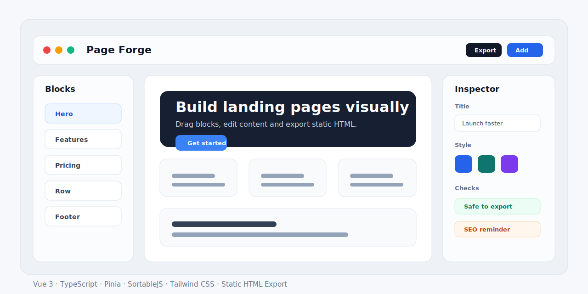
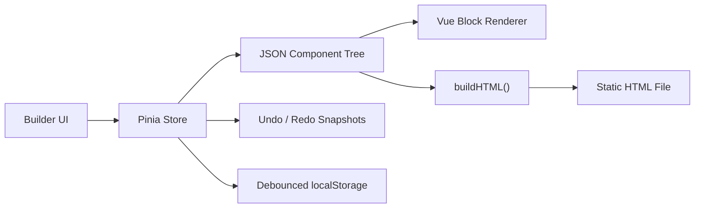

# Page Forge



[](https://github.com/Box-702/Page-Forge/actions/workflows/pages.yml)

一个基于 Vue 3 的可视化落地页搭建工具。用户可以通过区块编辑、顶层拖拽排序、Row 多列嵌套布局和实时预览快速搭建 SaaS 落地页，并一键导出可独立访问的静态 HTML。

**在线预览:** [https://box-702.github.io/Page-Forge/](https://box-702.github.io/Page-Forge/)

## 项目亮点

- **结构化页面模型:** 使用 JSON 组件树描述页面，避免把 HTML 字符串直接塞进状态里。
- **可维护的组合式架构:** 将构建器操作、历史记录、拖拽、导出、持久化等逻辑拆分为 composable。
- **真实拖拽排序:** 集成 SortableJS，支持顶层区块拖拽重排并自动记录历史快照。
- **嵌套布局能力:** Row 区块支持多列容器，组件可以递归渲染和递归更新。
- **撤销/重做:** 基于快照保存页面状态，支持 Ctrl+Z / Ctrl+Y。
- **导出安全处理:** 导出 HTML 时统一转义文本内容，并对链接、图片、背景图、OG 图等 URL 做白名单校验。
- **本地持久化:** 使用 localStorage 进行 500ms 防抖保存，刷新后自动恢复编辑状态。

## 技术栈

| 分类 | 技术 |
| --- | --- |
| 前端框架 | Vue 3, Composition API, `<script setup>` |
| 类型与状态 | TypeScript, Pinia |
| 样式与构建 | Tailwind CSS, Vite |
| 交互能力 | SortableJS, localStorage, Blob HTML export |

## 功能概览

- 8 种区块类型：Hero、Features、Pricing、CTA、Testimonials、FAQ、Footer、Row
- 画布实时编辑和桌面 / 平板 / 手机预览
- 右侧内容面板和样式面板
- 页面标题、描述、主题色、OG 图、favicon 配置
- 导出前检查：空页面、缺失 SEO 信息、危险链接、无效图片、空列提示
- 项目 JSON 导入 / 导出
- 静态 HTML 文件导出

## 架构示意



## 快速开始

```bash
npm install
npm run dev
```

常用命令：

```bash
npm run typecheck
npm run build
npm run check
```

## 项目结构

```text
src/
├── types/                 # 页面组件、样式、项目数据类型
├── stores/                # Pinia builder store
├── composables/           # 历史记录、拖拽、导出、持久化、编辑逻辑
├── utils/                 # HTML 导出、URL 安全校验、组件树工具
├── data/                  # 区块模板
└── components/
    ├── builder/           # 构建器界面
    ├── blocks/            # 页面区块渲染组件
    └── editors/           # 区块内容编辑器
```

## 可讲的实现点

这个项目适合作为前端实习简历项目展示，核心可以围绕下面几块展开：

- 为什么使用 JSON 组件树，而不是直接保存 HTML 字符串。
- 如何用 Pinia 管理组件树、选中态、页面配置和历史快照。
- 如何封装 composable，避免构建器组件变成大而全的 service。
- 如何处理 Row 多列嵌套组件的查找、更新、删除和复制。
- 如何在导出 HTML 时处理用户输入转义和 URL 白名单。

## 设计文档

更多设计取舍见 [DESIGN.md](./DESIGN.md)。
